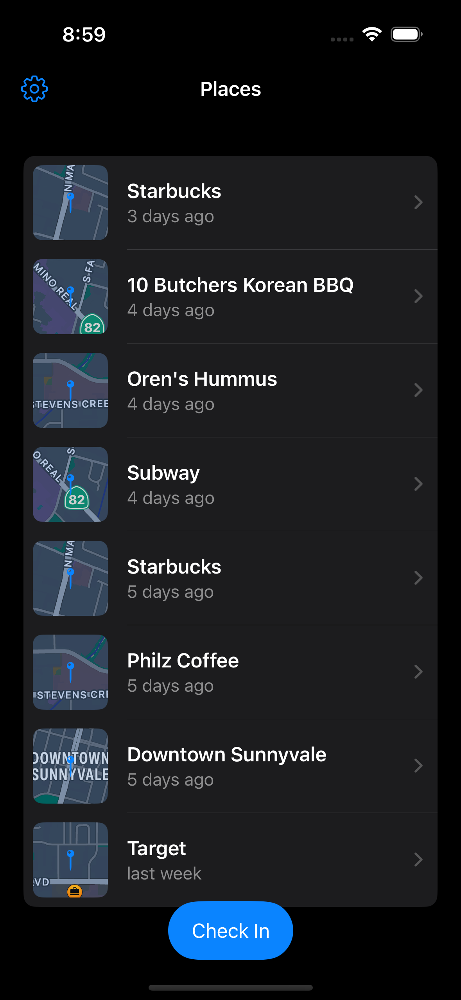
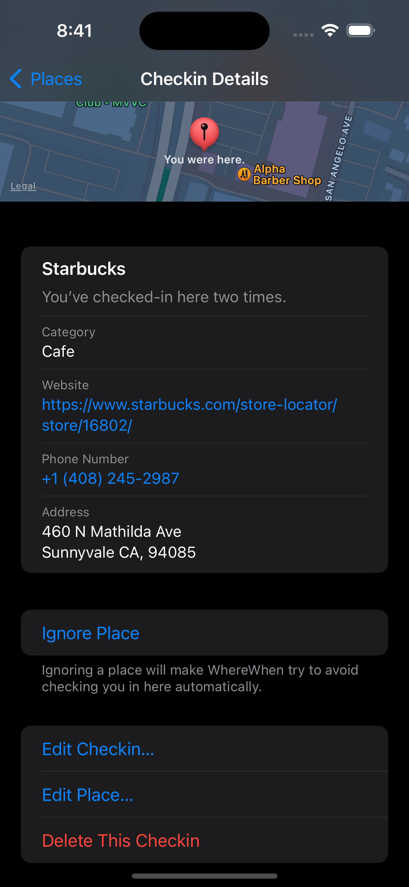
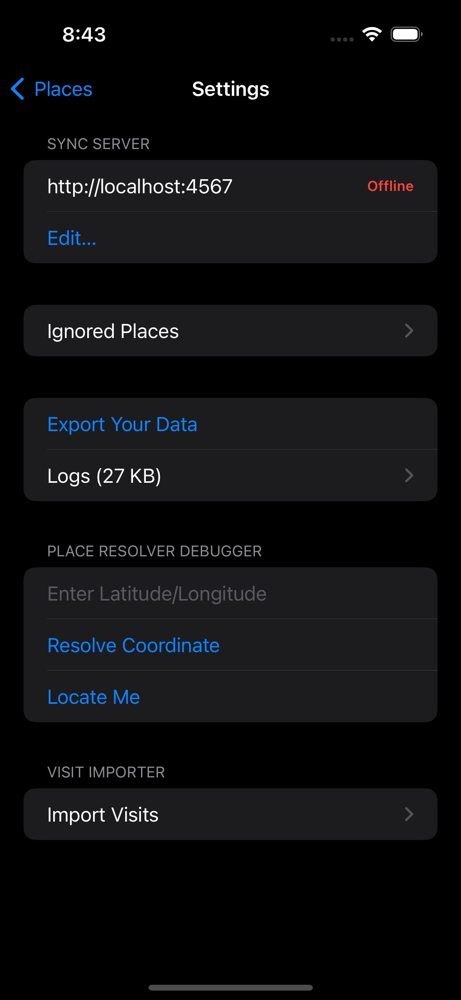
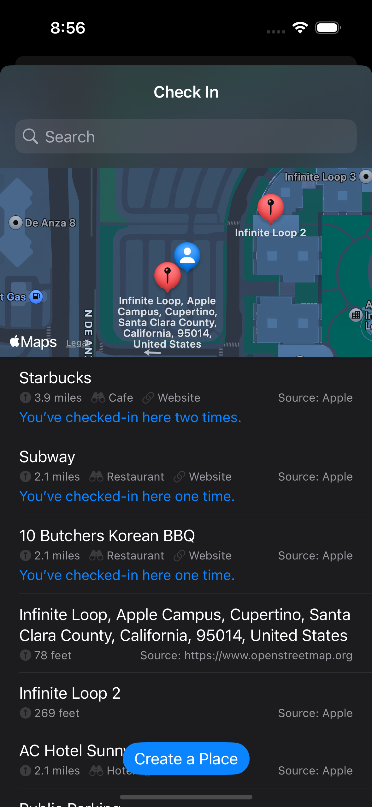

# WhereWhen

It's a way to see where you've been, and when.

## How it works

There's an iOS app that tracks where you go in the background. On its own it doesn't report that information back anywhere but you can export the SQLite database wherever you want. It's pretty barebones at the moment.

## Sync

There's also a bare bones sync server (also written in Swift). It's available as a [docker image](https://hub.docker.com/r/rockajima/wherewhen/tags) that you can run. If you do, you can point the iOS app at your sync server from the settings page. Just be aware that there is currently no authentication whatsoever (I run it all inside my Tailscale network).

## Screenshots

|Home|Checkin|Settings|Manual Check in|
|-|-|-|-|
|||||